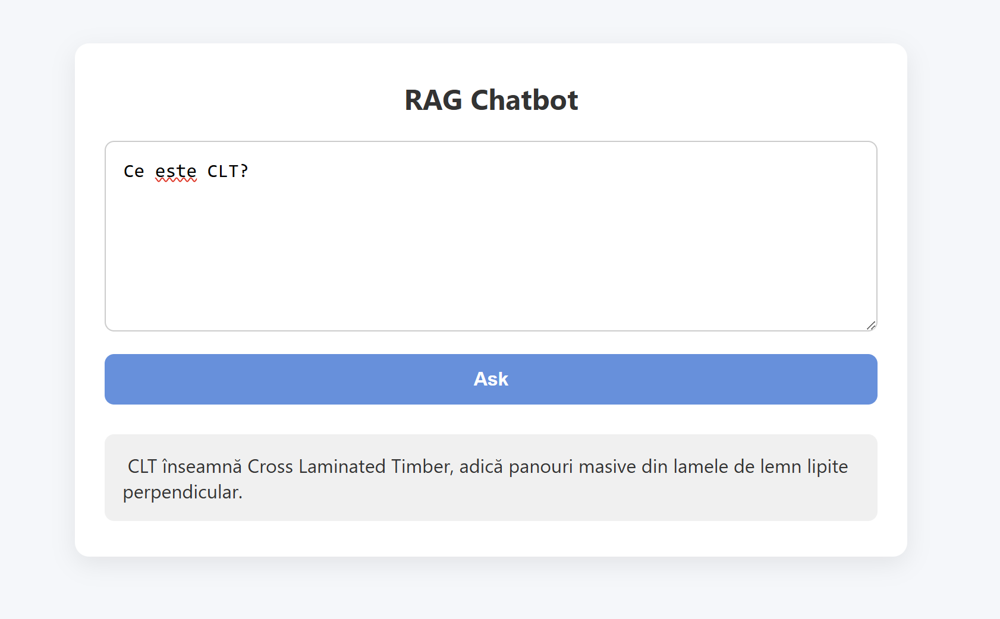

# RAG Chatbot with Together.ai and Flask

This is a Retrieval-Augmented Generation (RAG) chatbot that allows users to upload documents, embed them in a vector database, and then ask questions based on the content. The chatbot uses HuggingFace embeddings and a Together.ai language model (LLaMA 3) to generate accurate, context-aware answers.

## Requirements

Python 3.9+
Free Together.ai API key
One or more plain text documents (UTF-8 encoded)


## Features

- Upload and embed custom documents
- Chunk and store documents using ChromaDB vector store
- Ask questions and retrieve relevant information using semantic search
- Powered by Together.ai’s LLaMA 3 (70B) model
- Simple Flask front-end
- Python back-end using LangChain


## Tech Stack

| Part              | Library / Tool                          |
|-------------------|------------------------------------------|
| Embeddings        | `intfloat/multilingual-e5-base` via HuggingFace |
| Vector Store      | ChromaDB                                 |
| Language Model    | LLaMA 3 (70B) via Together.ai            |
| Backend Framework | Flask                                    |
| LLM Framework     | LangChain                                |
| Frontend          | HTML/CSS                                 |

---

## How It Works

1. **Document Loading**  
   Place your plain text file in `user_documents.txt`.

2. **Embedding & Vectorization**  
   Run `load_docs.py` to:
   - Read and chunk your text
   - Convert text chunks to embeddings
   - Store embeddings in a ChromaDB vector store

3. **User Interaction**
   - The user types a question into the Flask web form.
   - The question is sent to the RAG pipeline.
   - LangChain retrieves relevant document chunks.
   - The full prompt (question + context) is sent to Together.ai.
   - The model generates an answer, which is shown on the page.


## 🧑‍💻 Setup Instructions

### Clone the Repo

```bash
git clone https://github.com/7rdamian/document-retrieval-chatbot.git
```

### Create a .env file in the root directory: 

TOGETHER_API_KEY=your_api_key_here
You can get a free Together.ai key here: https://together.ai

### It's recommended to use a virtual environment:

```bash
python -m venv venv
source venv/bin/activate  # or venv\Scripts\activate on Windows
pip install -r requirements.txt
```

### Make sure you have a text file named user_documents.txt in the project folder. Then run:

```bash
python app/load_docs.py
```

### Run the Web App:

```bash
python main.py
```

### Then visit http://127.0.0.1:5000 in your browser.

It should look something like this:



## Credits:

Built with LangChain, ChromaDB, and Together.ai